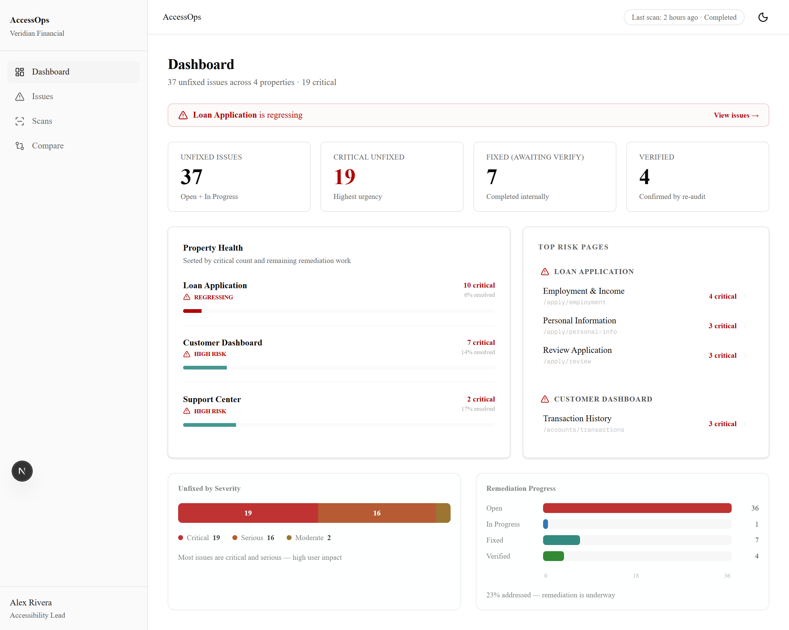
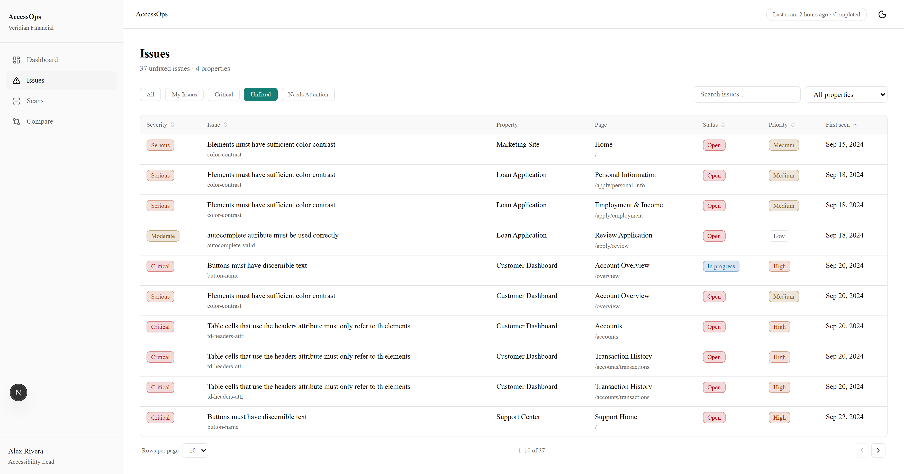
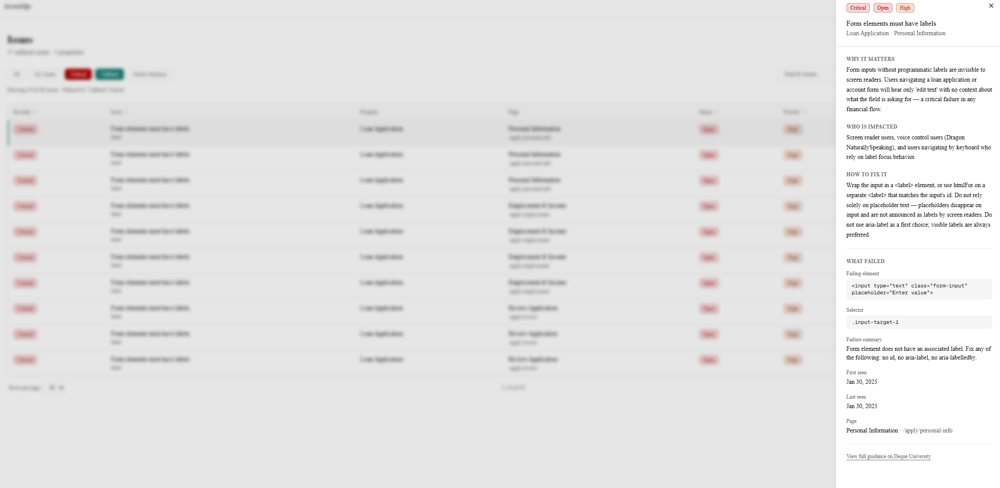
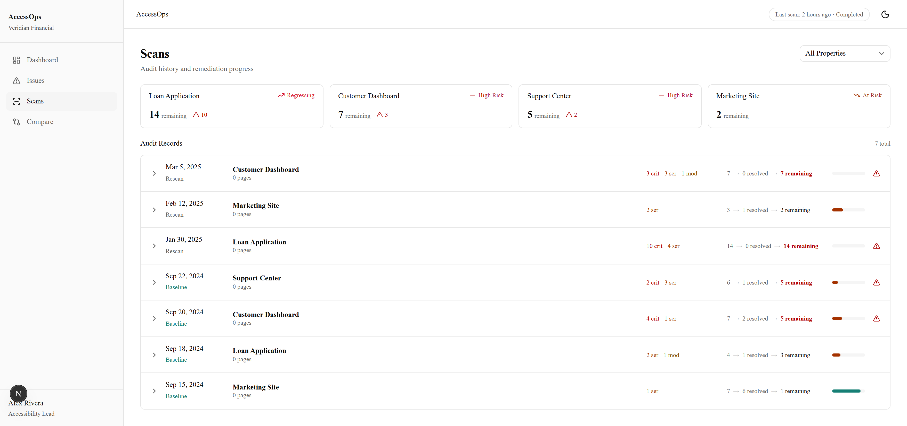
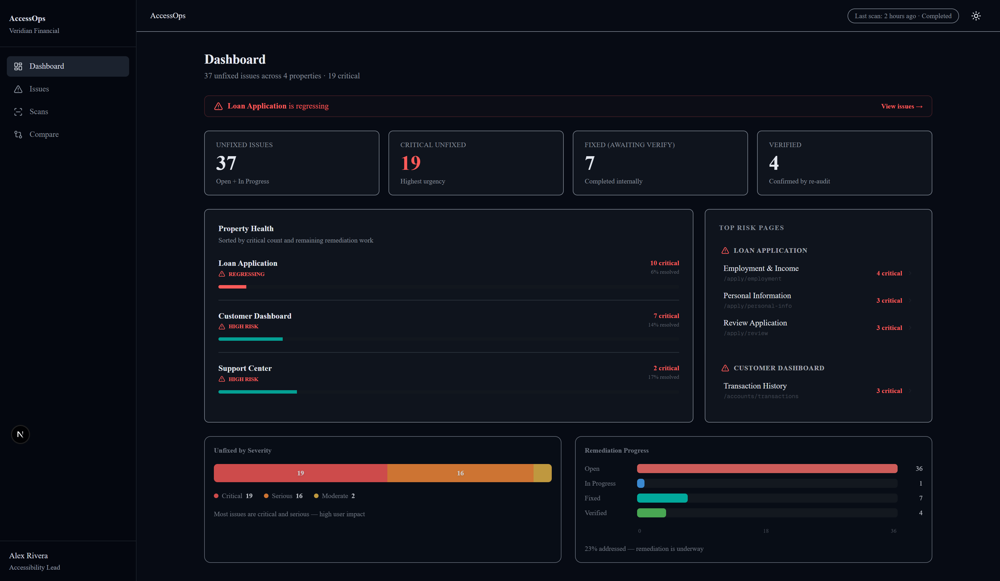
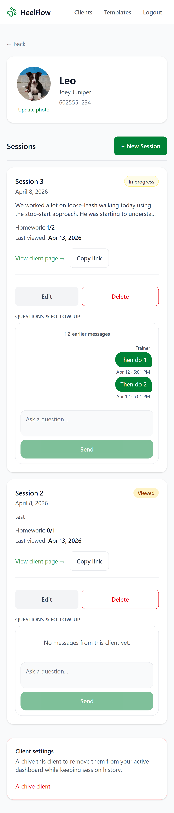
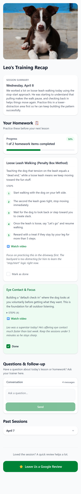

# Danny McKinney — Frontend Portfolio

[](https://dannymckinney.dev)
[](https://www.linkedin.com/in/danny-mckinney88)

Frontend engineer focused on building data-heavy, accessible UI systems for real-world enterprise workflows.

---

## 🌐 Live Site

👉 https://dannymckinney.dev

---

## ⭐ Flagship Project — AccessOps

**Accessibility remediation system for triaging, assigning, and verifying issues across audit cycles.**

👉 Live Demo: https://accessops.vercel.app/dashboard

👉 Source Code: https://github.com/dannymckinney88/accessops

| Dashboard                                                | Issues Table                                             |
| -------------------------------------------------------- | -------------------------------------------------------- |
|  |  |

| Issues Drawer                                          | Scans View                             |
| ------------------------------------------------------ | -------------------------------------- |
|  |  |

| Dark Mode                                     | Mobile                                                  |
| --------------------------------------------- | ------------------------------------------------------- |
|  |  |

AccessOps is built around the part most tools don’t solve — what happens after an audit.

Instead of acting like a scanner UI or report viewer, it treats accessibility as a backlog:
issues are triaged, assigned, grouped across pages, and tracked through remediation until verified.

The focus is not detection — it’s helping teams work through real remediation workflows.

### Features

- Decision-focused dashboard surfaces highest-risk areas and directs remediation effort
- Table-first triage workspace built for large issue sets with filtering, grouping, and ownership
- Issues persist until verified, separating implementation from actual resolution
- Audit history tracks progress and exposes regressions across scan cycles
- Designed for teams where accessibility is ongoing operational work, not a one-time audit

### Tech

- React · TypeScript · Next.js · Tailwind CSS · TanStack Table

---

## 🐾 Featured Project — HeelFlow

**Mobile-first workflow platform for private dog trainers to manage clients, deliver structured recaps, and track homework between sessions.**

👉 Live Demo: https://heelflow-xi.vercel.app
👉 Source Code: https://github.com/dannymckinney88/heelflow

| Trainer Dashboard                                               |
| --------------------------------------------------------------- |
|  |

| Client Sessions                                              |
| ------------------------------------------------------------ |
|  |

| Client Recap                                           |
| ------------------------------------------------------ |
|  |

HeelFlow focuses on the part of training that usually breaks down — what happens between sessions.

Instead of relying on memory or scattered notes, it gives trainers a structured way to:

- deliver clear, actionable homework
- track progress over time
- keep communication tied to each session

The experience is designed mobile-first, since most clients engage with training content on their phone.

### Features

- Structured session recaps with step-by-step training guidance
- Homework tracking with progress indicators
- Magic-link client pages (no login required for clients)
- Per-session messaging to keep follow-up contextual
- Reusable templates for faster session creation

### Tech

- Next.js · TypeScript · Tailwind CSS · Supabase · PostgreSQL

---

## 🚀 Projects

| Project                        | Description                                                                                                         | Tech                                                 |
| ------------------------------ | ------------------------------------------------------------------------------------------------------------------- | ---------------------------------------------------- |
| **AccessOps**                  | Accessibility remediation system for triaging, assigning, and verifying issues across audit cycles                  | React, TypeScript, Next.js, Tailwind, TanStack Table |
| **Accessibility Audit Tool**   | Full-stack audit system using Playwright and axe-core to scan live sites and surface actionable WCAG issues         | React, TypeScript, Playwright, axe-core, Express     |
| **Accessible Form Handling**   | Production-ready accessible form patterns including validation, modal focus management, and screen reader workflows | React, TypeScript, WCAG 2.1                          |
| **GitHub Repository Explorer** | Data-heavy interface for exploring repositories with pagination, caching, and resilient UI states                   | React, TypeScript, REST API                          |
| **Todo App**                   | Task management interface with filtering, drag-and-drop, and local persistence focused on UI interaction patterns   | React, TypeScript, Shadcn UI                         |

---

## ♿ Accessibility

Accessibility is built into how these systems are designed — not added after the fact.

That includes semantic HTML, keyboard-first interaction, screen reader workflows, focus management, and WCAG-compliant patterns across real UI scenarios.

Background: 5+ years leading accessibility work in enterprise fintech, including remediation of 900+ issues and supporting production compliance across complex workflows.

---

## 🧱 Tech Stack

- React · TypeScript · Next.js · Vite
- Tailwind CSS · Shadcn UI · CSS Modules
- TanStack Table · React Router
- Playwright · axe-core · Express

---

## 🛠 Running Locally

```bash
git clone https://github.com/dannymckinney88/Frontend-Portfolio.git
cd Frontend-Portfolio
npm install
npm run dev
```
